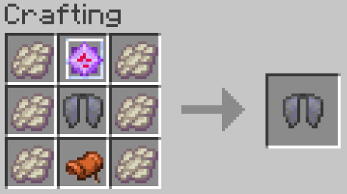

# 服务端功能与支持

## 乐魂加速

骑上乐魂后，你会看到这样的充能条。

此时长按前进键，乐魂会开始加速，并消耗充能条。

此时等充能耗尽或急转弯，乐魂会停止加速，并开始充能。

## 系统

### 菜单

!!! command "menu"
    或者 ++shift+f++ 也可以快捷打开

打开服务器菜单

### 大厅系统

**/hub** 或 **/lobby** 返回大厅。

### 组队系统

!!! command "party"
    _/pc 切换跨服队伍聊天_。

### 领地系统

[Dominion Docs（自建）](https://dominion.docs.tacs.top/notes/doc/player/){ .md-button }

### 幻翼生成控制

!!! command "pil"

### 点歌机

!!! command "music"

### 出生点保护

出生点半径256格内有出生点保护，不可建造或破坏方块。

请使用**/rtp**传送出出生点

### 门铃

按Shift放置按钮即可获得一个门铃。

## 游戏内便捷计算器

简单四则运算、潜影盒转换、合成材料计算、两点间距离计算…

详见[插件页面](https://modrinth.com/project/XoHTb2Ap)

~~绝对不是我不想重新写一份中文教程~~

### 生物掉头颅

*这其实是个菜单, 但是有人让我把他写出来*

## 客户端模组支持

以下模组被服务器支持，可以获得较好的使用体验：

* Jade
* Appleskin
* AsteorBar
* Distant Horzion
* Xaero's World Map
* Xaero's Minimap
* VoxelMap
* Syncmatica
* Do a Barrel Roll

## 附魔

[NeoEnchant+ Wiki（自建）](../neoenchants/enchantment/){ .md-button }

### 最大等级提升

| 附魔名称 | 新的最大等级 | 详细信息 |
| --- | --- | --- |
| 水下速掘 | 5 | 让你在水下呼吸更久 |
| 节肢杀手 | 10 | 提高对节肢生物的伤害 |
| 爆炸保护 | 7 | 减少爆炸伤害 |
| 破甲 | 5 | 降低护甲的有效性 |
| 引雷 | 5 | 向目标召唤闪电 |
| 致密 | 5 | 提高下落时使用重锤造成的伤害|
| 深海探索者 | 3 | 提高水下移动速度 |
| 效率 | 10 | 提高挖掘速度 |
| 摔落保护 | 10 | 减少跌落伤害 |
| 火焰附加 | 4 | 延长点燃时间 |
| 火焰保护 | 7 | 减少火焰伤害 |
| 火焰 | 5 | 延长箭矢点燃时间 |
| 时运 | 5 | 提高方块掉落物数量 |
| 冰霜行者 | 8 | 冻结水面 |
| 穿刺 | 10 | 提高对海洋生物的伤害 |
| 击退 | 10 | 增强击退效果 |
| 抢夺 | 5 | 提高怪物掉落物数量 |
| 忠诚 | 8 | 提高三叉戟回返速度 |
| 海之眷顾 | 5 | 提高垂钓的稀有度 |
| 饵钓 | 5 | 提高垂钓速度 |
| 修补 | 5 | 每级提高物品的经验修复效果 |
| 多重射击 | 3 | 一次射出更多箭矢 |
| 穿透 | 10 | 箭矢可穿透多个实体 |
| 力量 | 7 | 提高弓的伤害 |
| 弹射物保护 | 7 | 减少投射物伤害 |
| 保护 | 5 | 减少所有来源的伤害 |
| 冲击 | 10 | 增强箭矢的击退效果 |
| 快速装填 | 5 | 减少弩的装填时间 |
| 水下呼吸 | 8 | 增加氧气泡数量 |
| 激流 | 8 | 在投掷时推进玩家 |
| 锋利 | 7 | 提高近战伤害 |
| 亡灵杀手 | 10 | 提高对亡灵生物的伤害 |
| 灵魂疾行 | 7 | 在灵魂沙/灵魂土上移动更快 |
| 横扫之刃 | 10 | 提高横扫攻击伤害 |
| 迅捷潜行 | 7 | 提高潜行移动速度 |
| 荆棘 | 4 | 反伤攻击者 |
| 耐久 | 10 | 提高物品耐久度 |
| 风爆 | 5 | 提高风爆的击退效果 |

/// caption
提升后的最大等级
///

## 数据包

服务器数据包列表(不保证最新)：

* [file/Amplified_Nether_1.21_v1.2.11.zip (world)]
* [file/BeyondEnchant-1.21.2.zip (world)]
* [file/BlazeandCave's_Advancements_Pack_1.19.1.zip (world)]
* [file/BlazeandCave's_Advancements_Pack_Amplified_Nether.zip (world)]
* [file/BlazeandCave's_Advancements_Pack_Nullscape.zip (world)]
* [file/BlazeandCave's_Advancements_Pack_Terralith.zip (world)]
* [file/Hearths_v1.0.4_f12-80.dp.zip (world)]
* [file/NeoEnchant-V5.12.1-for-1.21.6-to-1.21.8-fixed-TACS.zip (world)]
* [file/NeoEnchantAddon-Structure-V1.1.0-for-1.21.6.zip (world)]
* [file/Nullscape_1.21_v1.2.13.zip (world)]
* [file/Structory_1.21_v1.3.11.zip (world)]
* [file/Structory_Towers_1.21_v1.0.13.zip (world)]
* [file/Terralith_1.21.5_v2.5.11.zip (world)]
* [file/VanillaTweaks_TACS_MC1.21-1.21.8.zip (world)]
* [file/hopobettermineshaft-1-21-6-1-3-2-zh-cn.zip (world)]
* [file/hopobetterruinedportals-1-21-6-1-4-7-zh-cn.zip (world)]
* [file/hopobetterunderwaterruins-1-21-6-1-2-4-zh-cn.zip (world)]
* [file/qraftyfied_-_INDUSTRIAL.zip (world)]
* [file/terratonic-3.0.0-datapack.zip (world)]
* [file/v10qraftyfied_-_TERRALITH.zip (world)]

欲了解其中内容，可以自行搜索。

## 合成表

* 
*  **合成后会单独返回第二个鞘翅**
* 
* 
* 
* 

